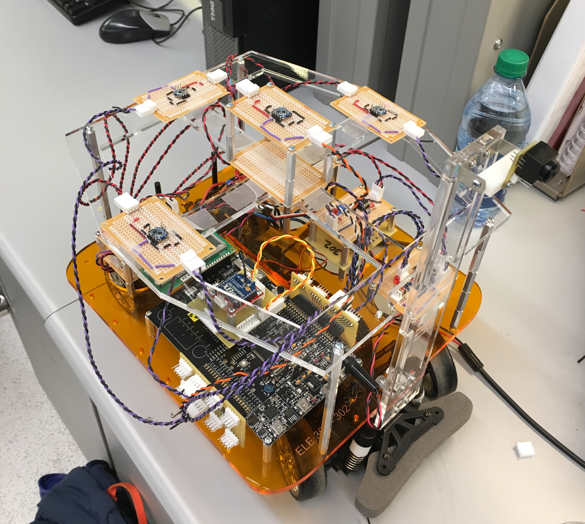
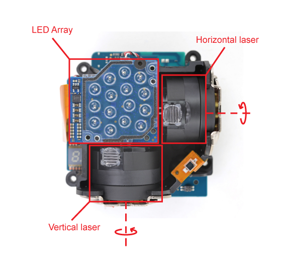
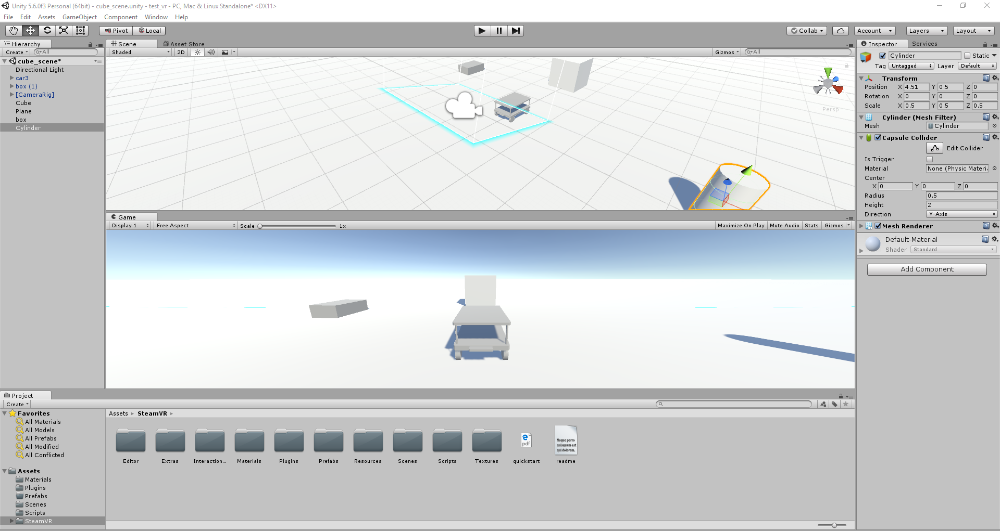
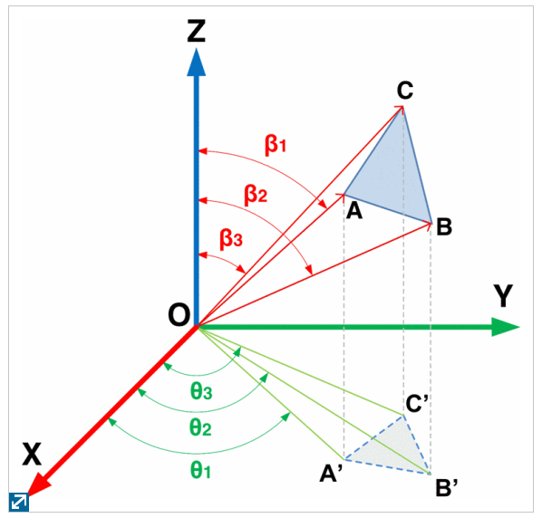

# Virtual Reality Tracked Car using Valve Lighthouse System

The HTC Vive is a popular virtual reality system that includes a headset, two controllers, and two base stations. The headset and controllers are equipped with dozens of infrared sensors, and the base stations sweep the tracking area with infrared lasers - the timing of these lasers is used to track headset and controller position.

By building an infrared sensor grid to a miniature electric car and decoding the HTC Vive base station laser tracking protocol, we can track the car in virtual reality. Each sensor sends its readings to the PSoC computer onboard the car, which runs a C script to convert sensor signals to the car's positional data. The data is then streamed over wireless XBee communication to a computer that manipulates a virtual car mesh in Unity

Lighthouse System/Protocol:  
Each Vive base station is a lighthouse that sweeps the room with infrared light. On its upper left there is an LED array that emits a sync flash every 8.33 ms (120 Hz). It also has two rotors with lasers that rotate around the horizontal and vertical axes (with respect to the base station’s coordinate system) at 3600 rpm or 60 revolutions per second. 

The rotor that rotates around the vertical axis sweeps the tracking volume in front of the base station with a vertical fan of light from left to right, and the rotor that rotates around the horizontal axis sweeps the tracking volume with a horizontal fan of light from bottom to top. These sweeps are interleaved: first the vertical laser sweeps left to right, then half a revolution or 8.33 ms later the horizontal laser sweeps bottom to top. With two base stations the order is: base station A vertical laser, base station A horizontal laser, base station B vertical laser, base station B horizontal laser. A sync flash occurs at the beginning of each 8.33 ms period to synchronize the events and the width of the sync flash pulse sets three bits of information - skip, data, and axis.

In Unity, we created a simple 3D scene and a box to represent our car. We attach a more detailed mesh of a car we designed in Blender to the box and a SensorTriang C# script. The script opens a serial port and reads the data sent by the PSoC. It converts the time measurements to angles, azimuth (beta) and elevation (theta), from the lighthouse.

Given three sensors that form a triangle and the beta/theta angles to each sensor, we can calculate the angles between any two sensors with respect to the origin. We can then form a system of non-linear equations for the unknown ranges or distances to each sensor. The length of sides AB, BC, and AC are known and measured beforehand on the car mast. Using the Newtonian root finding method and the Jacobian we iterate until the error is less than a certain threshold.

